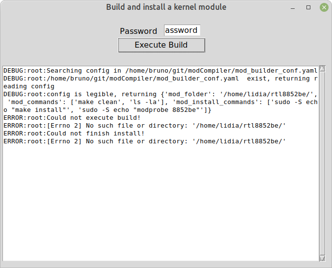

# Complies and installs a kernel module from gui, with one click

I made this program for my mum, so she can use her new pc
with her fancy new wi-fi, not in kernel 5.18+. She needs
something that one can just click after kernel update.

She has https://github.com/HRex39/rtl8852be

## How to use
Prepare the single executable, prepare the instructions for
building the module, give them to your user, have them set
the password, and run the app.


## Prerequisites

- all the needed building software is installed
- the module is already checked out

## Create virtual environment

Create virtualenv

```bash
virtualenv venv
```

and install dependencies
```bash
./venv/bin activate
pip install -r requirements.txt
```

## Build options

1. wheel 
```bash
python -m build
```
2. pyinstaller

Cli
```bash
pyinstaller --onefile mod_builder/app.py
```

G

```bash
pyinstaller --onefile mod_builder/mod_builder_gui.py
```

## Links
- https://stackoverflow.com/questions/68198575/how-can-i-displaymy-console-output-in-tkinter
- https://tkdocs.com/